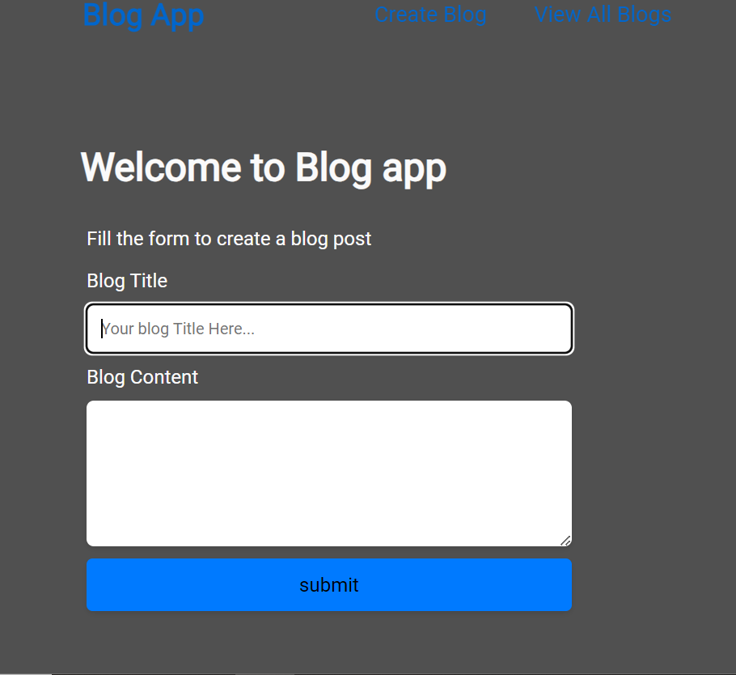
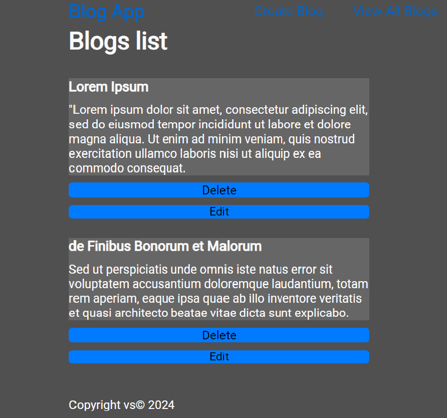

# Blog App
The Blog App is a simple web application that allows users to create, edit, view, and delete blog posts. Built with Node.js, Express.js, and EJS for templating. The main goal of this project was to learn and demonstrate ejs, express and middleware, hence there is no database currently and blog 
posts disappear once the server is restarted.





## Features
1. Post Creation: Users are able to create new posts.
2. Post Viewing: The blog page allows the users to view all their posts.
3. Post Update/Delete: Users are able edit and delete posts as needed.

## Installation

1. Clone the repository.
    ```bash
    git clone git@github.com:svolain/Blog-App.git
    ```
2. Navigate to the project directory.
3. Install the necessary dependencies by running:
    ```bash
    npm install
    ```
    
## Usage

1. Ensure you have Node.js or Nodemon installed.

2. To start the server, run:

```bash
node index.js
```
or

```bash
nodemon index.js
```

3. Open your browser and navigate to `http://localhost:8000` to view the index.html page.
